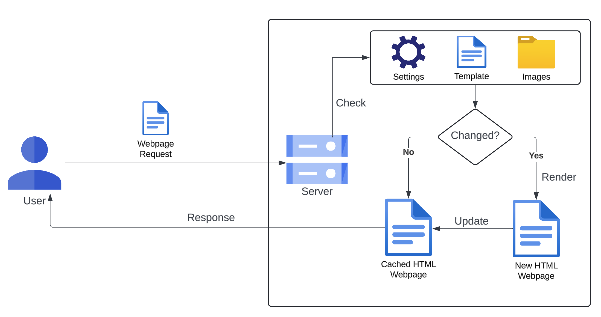

# Development

## Start server

```shell
npm start   # build and run the server
npm build   # only build js files
```

## Environment

* [NodeJS](https://nodejs.org/en)
* [npm](https://www.npmjs.com)
* [TypeScript](https://www.typescriptlang.org/docs/handbook/intro.html)
  ```shell
  npm install -g typescript
  ```

## Libraries and Frameworks

* [koa](https://github.com/koajs/koa)
* [koa-router](https://github.com/koajs/router)
* [koa-send](https://github.com/koajs/send)
* [hasha](https://github.com/sindresorhus/hasha)
* [jsdom](https://github.com/jsdom/jsdom)

## Style Guide

* [Google TypeScript Style Guide](https://google.github.io/styleguide/tsguide.html)

## Directory Structure

~~~python
.
├── constants.ts        # Global constants
├── resource_monitor.ts # Resource monitor
├── routes.ts           # All sorts of routes based on koa-router
├── server.ts           # Koa app, register middlewares, and default route handler
├── service.ts          # Bussiness logic (known as service layer)
├── settings.ts         # Settings interface
└── template            # HTML template files, and other static files 
    ├── 404.html        # The 404 webpage
    ├── index.css       # The main CSS file
    └── index.html      # The main webpage template
~~~

## Architecture



The HTML webpage is static and rendered on the server side. When the server receives a request, it checks the `gallery-settings.json` settings file, the `src/template/index.html` template file, and the images in the gallery directory. If any changes are detected, such as adding or deleting image files, the server rerenders the webpage and updates the cache. If no changes are found, the server serves the cached file to save computational resources.

The resource monitor functionality is implemented in `src/resource_monitor.ts`, which supports hot updates. This means that changes can be applied without restarting the server.
